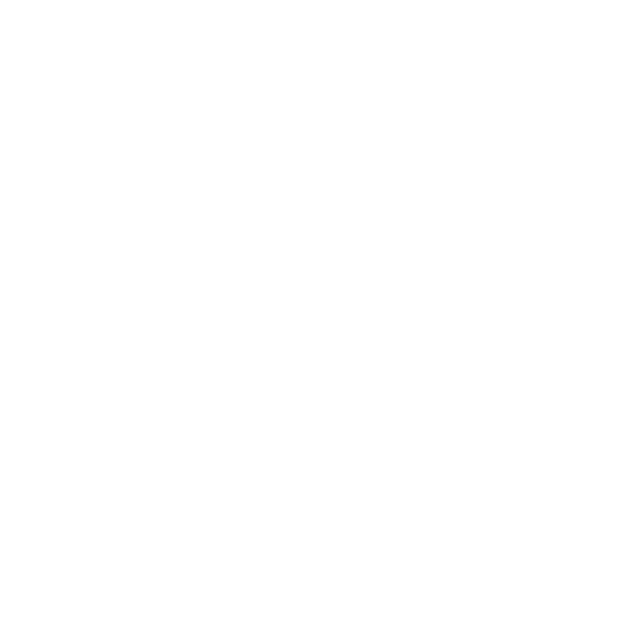
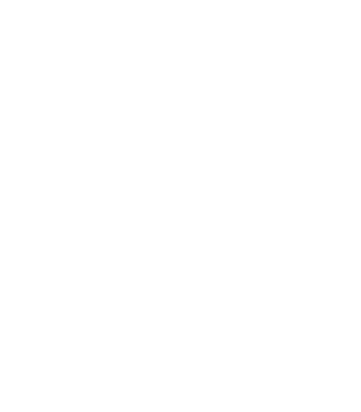
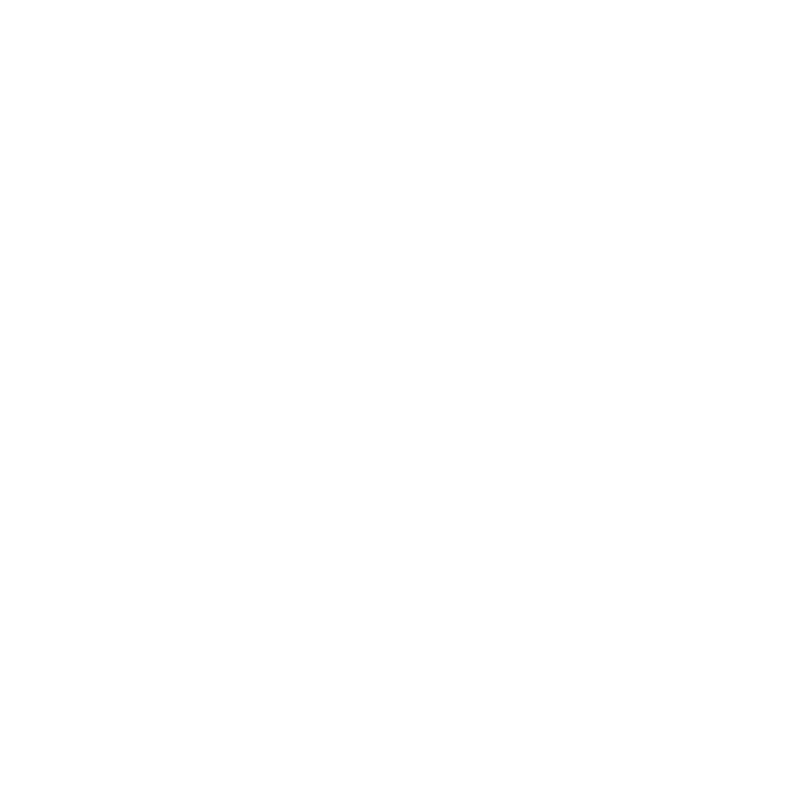

# 🚀 Vinay's Portfolio Wonderland


## ✨ Welcome to My Digital Universe!

Hey there! 👋 Welcome to my portfolio website's codebase. This isn't just any portfolio—it's a cosmic blend of modern tech and sleek design. Featuring smooth animations, a stellar tech stack, and some seriously cool interactive elements!

## 🎯 Key Features

- 🌗 Stunning hero section with orbital animations
- 🎨 Gradient-rich, modern UI design
- 📱 Fully responsive across all devices
- 🔄 Smooth scrolling section navigation
- ⚡ Lightning-fast performance
- 🎮 Interactive elements and hover effects

## 🛠️ Tech Stack

<div align="center">
  
  
  
  
</div>

- **Framework**: Next.js 14 (App Router)
- **Language**: TypeScript
- **Styling**: Tailwind CSS
- **Animation**: Framer Motion
- **Deployment**: Vercel

## 🚀 Getting Started

```bash
npm run dev
# or
yarn dev
# or
pnpm dev
# or
bun dev
```

Open [http://localhost:3000](http://localhost:3000) with your browser to see the result.

You can start editing the page by modifying `app/page.tsx`. The page auto-updates as you edit the file.

This project uses [`next/font`](https://nextjs.org/docs/basic-features/font-optimization) to automatically optimize and load Inter, a custom Google Font.

## Learn More

To learn more about Next.js, take a look at the following resources:

- [Next.js Documentation](https://nextjs.org/docs) - learn about Next.js features and API.
- [Learn Next.js](https://nextjs.org/learn) - an interactive Next.js tutorial.

You can check out [the Next.js GitHub repository](https://github.com/vercel/next.js/) - your feedback and contributions are welcome!

## Deploy on Vercel

The easiest way to deploy your Next.js app is to use the [Vercel Platform](https://vercel.com/new?utm_medium=default-template&filter=next.js&utm_source=create-next-app&utm_campaign=create-next-app-readme) from the creators of Next.js.

Check out our [Next.js deployment documentation](https://nextjs.org/docs/deployment) for more details.
